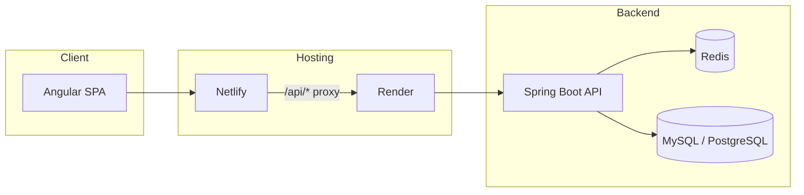

# URL Shortener

A full-stack URL shortening service with a modern Angular frontend and a Spring Boot REST API. Create short links, look up metadata, track clicks, and redirect users to the original destination — with Redis-backed caching and profile-based configuration for local and production environments.

**Live demo**

| Layer    | URL |
|----------|-----|
| Frontend | [url-sharpener.netlify.app](https://url-sharpener.netlify.app/) |
| API      | [urlsharpener.onrender.com](https://urlsharpener.onrender.com/) |

---

## Features

- **Shorten long URLs** — generates unique 8-character codes with automatic deduplication for existing URLs
- **Redirect & track** — HTTP 302 redirects with click-count analytics
- **Metadata lookup** — inspect original URL, expiration, and usage stats without following the redirect
- **Expiration** — links expire after 2 days by default
- **Soft delete** — removed links are logically deleted and evicted from cache
- **Redis caching** — fast lookups for high-traffic redirects
- **Profile-based config** — MySQL + local Redis for development; PostgreSQL (Neon) + Upstash Redis in production

---

## Architecture



In production, the Netlify frontend proxies `/api` requests to the Render-hosted backend. Locally, the Angular dev server proxies API calls to `localhost:8080`.

---

## Tech Stack

| Layer      | Technologies |
|------------|--------------|
| Backend    | Java 21, Spring Boot 4.1, Spring Data JPA, Bean Validation, Spring Cache |
| Frontend   | Angular 21, TypeScript, RxJS |
| Database   | MySQL (dev), PostgreSQL / Neon (prod) |
| Cache      | Redis (dev), Upstash Redis (prod) |
| Deployment | Docker, Render (API), Netlify (SPA) |
| Build      | Maven, npm |

---

## Project Structure

```
url-shortener/
├── client-app/          # Angular frontend
├── src/                 # Spring Boot backend
│   ├── main/java/       # Controllers, services, entities, config
│   └── test/java/       # Unit & integration tests
├── scripts/             # Dev and prod run helpers
├── Dockerfile           # Production container image
├── render.yaml          # Render deployment blueprint
└── pom.xml              # Maven build configuration
```

---

## Prerequisites

- **Java 21**
- **Node.js 20+** and npm
- **MySQL** (local development)
- **Redis** (local development)
- **Maven** (or use the included `./mvnw` wrapper)

---

## Getting Started

### 1. Clone the repository

```bash
git clone <repository-url>
cd url-shortener
```

### 2. Configure environment variables

Create a `.env.dev` file in the project root with your local settings:

```bash
SPRING_PROFILES_ACTIVE=dev
JDBC_URL=jdbc:mysql://localhost:3306/url_shortener
JDBC_USERNAME=your_username
JDBC_PASSWORD=your_password
CORS_ALLOWED_ORIGINS=http://localhost:4200
REDIS_HOST=localhost
REDIS_PORT=6379
```

### 3. Start the backend

```bash
./scripts/run-dev.sh
```

The API will be available at `http://localhost:8080`.

### 4. Start the frontend

```bash
cd client-app
npm install
npm start
```

Open `http://localhost:4200`. API requests are proxied to the backend via `client-app/proxy.conf.json`.

---

## API Reference

Base path: `/api/v1`

| Method | Endpoint | Description |
|--------|----------|-------------|
| `POST` | `/urls` | Create a short URL |
| `GET` | `/urls/{shortCode}` | Redirect to the original URL (302) |
| `GET` | `/urls/{shortCode}/metadata` | Get link metadata |
| `DELETE` | `/urls/{shortCode}` | Soft-delete a short URL |

**Health checks**

| Method | Endpoint | Description |
|--------|----------|-------------|
| `GET` | `/` | Service info |
| `GET` | `/health` | Liveness probe |

### Example: create a short URL

```bash
curl -X POST http://localhost:8080/api/v1/urls \
  -H "Content-Type: application/json" \
  -d '{"url": "https://example.com/very/long/path"}'
```

**Response** `201 Created`

```json
{
  "id": 1,
  "originalUrl": "https://example.com/very/long/path",
  "shortCode": "a1b2c3d4",
  "expiresAt": "2026-08-10T14:30:00",
  "clickCount": 0
}
```

---

## Running Tests

**Backend**

```bash
./mvnw test
```

**Frontend**

```bash
cd client-app
npm test
```

---

## Deployment

### Backend (Render)

The API is deployed as a Docker web service on Render. Configuration is defined in `render.yaml` and `Dockerfile`.

Required environment variables:

| Variable | Description |
|----------|-------------|
| `SPRING_PROFILES_ACTIVE` | Set to `prod` |
| `JDBC_URL` | Neon PostgreSQL JDBC URL |
| `JDBC_USERNAME` | Database username |
| `JDBC_PASSWORD` | Database password |
| `REDIS_HOST` | Upstash Redis hostname |
| `REDIS_PASSWORD` | Upstash Redis password |
| `REDIS_PORT` | `6379` |
| `REDIS_SSL` | `true` |
| `CORS_ALLOWED_ORIGINS` | Frontend origin (e.g. `https://url-sharpener.netlify.app`) |

### Frontend (Netlify)

The Angular app is built and deployed to Netlify. `client-app/netlify.toml` configures:

- API proxy: `/api/*` → Render backend
- SPA fallback for client-side routing

Build command (from repo root):

```bash
npm run build
```

---

## Configuration Profiles

| Profile | Database | Cache | Use case |
|---------|----------|-------|----------|
| `dev`   | MySQL    | Local Redis | Local development |
| `prod`  | PostgreSQL (Neon) | Upstash Redis | Production |

Profile-specific settings live in `application-dev.properties` and `application-prod.properties`.

---

## License

This project is provided as-is for educational and demonstration purposes.
